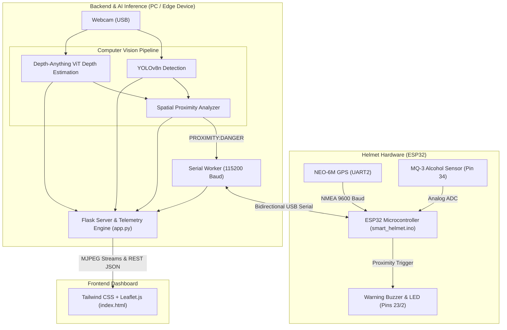

# 🛡️ Smart Helmet: Edge AI Multimodal Driver Assistance System

[](https://www.python.org/)
[](https://pytorch.org/)
[](https://docs.ultralytics.com/)
[](https://huggingface.co/)
[](https://developer.nvidia.com/cuda-zone)
[](https://www.espressif.com/en/products/socs/esp32)
[](LICENSE)

An intelligent, real-time **Advanced Driver Assistance System (ADAS)** and **IoT Telemetry Platform** for motorcyclists. The system combines **YOLOv8 object detection**, **Depth-Anything monocular depth estimation**, **GPS tracking**, and **alcohol impairment detection** into a unified web-based safety dashboard and hardware alert pipeline.

---

## 🌟 Key Features

### 👁️ Real-Time Computer Vision & Edge AI
- **Obstacle & Vehicle Detection:** Powered by **YOLOv8n** for low-latency detection of vehicles, pedestrians, and road hazards.
- **Zero-Shot Monocular Depth Estimation:** Integrates **Depth-Anything (Vision Transformer)** to compute dense disparity maps from a single 2D camera feed without expensive LiDAR.
- **Intelligent Spatial Proximity Analyzer:** Projects YOLO bounding boxes onto dense depth maps to extract obstacle distance percentiles, triggering `DANGER`, `WARNING`, or `SAFE` collision states.
- **Optimized Single-Pass Pipeline:** Synchronous background inference worker prevents duplicate model runs and maximizes streaming FPS on CUDA.

### 📡 Multimodal IoT & Microcontroller Integration
- **GPS Live Tracking:** NEO-6M module integration streaming latitude, longitude, and speed in real-time.
- **Drunk Driving Prevention:** MQ-3 alcohol sensor monitoring the rider's breath with threshold alerts.
- **Bidirectional Hardware Communication:** Sends proximity alerts back to the ESP32 to actuate an onboard warning buzzer and LED.
- **Smart Telemetry Fallback:** Automatically switches to a realistic simulation mode if hardware is disconnected, allowing complete offline testing.

### 💻 Modern Web Dashboard
- **Dual Live Streams:** Synchronized side-by-side feeds for object detection and depth heatmap visualization.
- **Interactive GPS Map:** Leaflet.js map with live position marker and historical route breadcrumb trail.
- **Telemetry Gauges:** Real-time visual speedometer and alcohol sensor level bars.
- **Responsive Dark Mode:** Built with Tailwind CSS and Inter typography.

---

## 🏗️ System Architecture



---

## 🛠️ Tech Stack

- **Deep Learning & CV:** PyTorch, Ultralytics YOLOv8, Hugging Face Transformers (`LiheYoung/depth-anything-small-hf`), OpenCV, NumPy.
- **Backend Server:** Flask, PySerial, Threading & Queues.
- **Frontend Dashboard:** HTML5, Tailwind CSS, Leaflet.js, OpenStreetMap.
- **Embedded Firmware:** C/C++ (Arduino framework for ESP32), `TinyGPS++`, `HardwareSerial`.

---

## 📋 Hardware Requirements & Pinout

| Component | Description | ESP32 Pin |
| :--- | :--- | :--- |
| **Microcontroller** | ESP32 NodeMCU / DevKit V1 | USB to PC |
| **GPS Module** | NEO-6M GPS Module | **RX:** Pin 16, **TX:** Pin 17 |
| **Alcohol Sensor** | MQ-3 Gas Sensor (Analog Out) | **A0:** Pin 34 |
| **Warning Buzzer** | 5V Active Buzzer | **Signal:** Pin 23 |
| **Status LED** | Warning LED / Onboard LED | **Signal:** Pin 2 |
| **Camera** | USB Webcam / Helmet Camera | USB to PC |

---

## 🚀 Quick Start Guide

### 1. Prerequisites
- Python **3.8+** (Python 3.11 with CUDA recommended)
- Git & Arduino IDE (for flashing ESP32)

### 2. Clone the Repository
```bash
git clone https://github.com/kewkatoo/smart-helmet.git
cd smart-helmet
```

### 3. Install Dependencies
```bash
pip install -r "smart-helmet-main (1)/smart-helmet-main/requirements.txt"
```

### 4. Flash ESP32 Firmware (Optional if testing without hardware)
1. Open [`smart-helmet-main (1)/smart-helmet-main/arduino/smart_helmet.ino`](file:///c:/Users/adity/Downloads/SMART/smart-helmet-main%20%281%29/smart-helmet-main/arduino/smart_helmet.ino) in the Arduino IDE.
2. Install the **TinyGPS++** library via the Library Manager.
3. Select your ESP32 board and COM port, then click **Upload**.

### 5. Run the Application
You can run the launcher directly from the root directory:
```bash
python run_smart_helmet.py
```

### 6. Access the Dashboard
Open your browser and navigate to:
```
http://localhost:5000
```

> **Note:** If no physical ESP32 or webcam is connected, the application will automatically activate **Synthetic Demo Mode**, allowing full demonstration of telemetry, map tracking, and proximity warnings.

---

## 📡 API Endpoints

| Endpoint | Method | Description |
| :--- | :--- | :--- |
| `/` | `GET` | Main responsive dashboard interface |
| `/yolo_feed` | `GET` | Live MJPEG video stream with YOLOv8 bounding boxes |
| `/depth_feed` | `GET` | Live MJPEG video stream with Depth-Anything colormap |
| `/proximity_status`| `GET` | Returns current proximity status (`SAFE`, `WARNING`, `DANGER`) |
| `/sensor_data` | `GET` | Returns live/simulated JSON telemetry (GPS, speed, MQ-3) |
| `/system_status` | `GET` | System health check (camera status, hardware connection, port) |

---

## 🔬 AI/ML Technical Details

### 1. Monocular Depth Estimation
Depth estimation is performed using **Depth-Anything-Small**, a Vision Transformer (ViT) model trained on large-scale unlabeled datasets via self-training. The model predicts a relative inverse depth (disparity) map $D(x, y) \in [0, 255]$.

### 2. Spatial Region-of-Interest (ROI) Proximity
For each object detected by YOLO with bounding box coordinates $B_i = [x_1, y_1, x_2, y_2]$, the average depth intensity is calculated over the region:
$$\bar{D}_i = \frac{1}{|B_i|} \sum_{(x,y) \in B_i} D(x, y)$$

The overall scene hazard level is computed based on the maximum disparity (closest object):
$$\text{Status} = \begin{cases} \text{DANGER} & \text{if } \max_i(\bar{D}_i) \ge 160 \\ \text{WARNING} & \text{if } \max_i(\bar{D}_i) \ge 100 \\ \text{SAFE} & \text{otherwise} \end{cases}$$

---

## 📁 Repository Structure

```
smart-helmet/
├── run_smart_helmet.py             # Root one-click launcher
├── README.md                       # Documentation
└── smart-helmet-main (1)/
    └── smart-helmet-main/
        ├── app.py                  # Core Flask server & serial thread workers
        ├── requirements.txt        # Python package dependencies
        ├── yolov8n.pt              # YOLOv8 model weights
        ├── models/
        │   ├── depth.py            # Depth-Anything ViT model wrapper
        │   └── yolo.py             # YOLOv8 object detection wrapper
        ├── utils/
        │   ├── proximity_analyzer.py# Safety distance & threshold analyzer
        │   └── video_feed.py       # Camera pipeline & MJPEG generator
        ├── templates/
        │   └── index.html          # Web dashboard (Tailwind CSS + Leaflet.js)
        ├── static/                 # Warning assets & icons
        └── arduino/
            └── smart_helmet.ino    # ESP32 firmware (GPS + MQ-3 + Buzzer)
```

---

## 📄 License
This project is licensed under the **MIT License** - see the LICENSE file for details.
